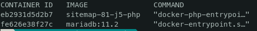
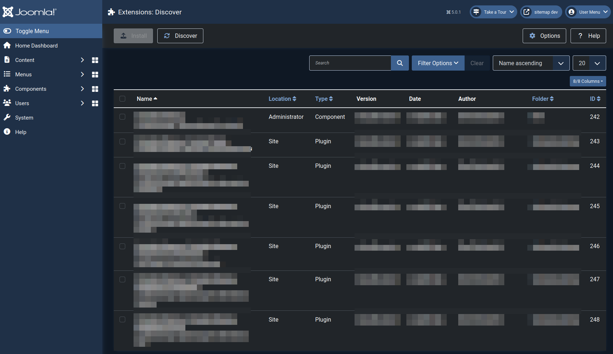

# Joomla! container based development environment

- It is designed for one Joomla! installation per container instance
- Copy the repo per Joomla installation

## Choose PHP version
In the `docker-compose.yml` you can choose the PHP version by changing the Dockerfile, which is located in the `php` folder.

```yaml
php:
    build: 
      context: ./php/
      dockerfile: Dockerfile-8.1
```

## Multiple parallel instances
If you want to run multiple instances in parallel, you need to change the port numbers to be unique.

The port number before the `:` is the external port number and needs to be unique on you computer. The port numer after the `:` is the container internal port number and needs to stay the same.

```yaml
...
    ports:
        - '43001:3306'
...
    ports:
        - '43000:80'
```

## Install Joomla!

1. Remove the `index.html` from the `html` folder
2. Unpack Joomla! to the `html` folder

## Application file permissions

As in all server environments, your application needs the correct file permissions to work properly. You can change the files throughout the container, so you won't care if the user exists or has the same ID on your host.

```bash
sudo docker-compose exec php chown -R www-data:www-data /var/www/html
```

## Install your extension from a git repository
### 1. Mount repository as volume
Extends `docker-compose.yml` with your extension repository as mounted volumes.

```yaml
php:
    build: 
      context: ./php/
      dockerfile: Dockerfile-8.1
    working_dir: /var/www/html
    volumes:
      - './html:/var/www/html'
      - 'PATH/TO/YOUR/GITREPO/EXTENSIONNAME/:/EXTENSIONNAME'
      - 'PATH/TO/YOUR/GITREPO/EXTENSIONNAME-PLUGIN/:/EXTENSIONNAME-PLUGIN'
    ports:
      - '43000:80'
```

### 2. Start the containers and go into the webserver container

```bash
sudo docker exec -it CONTAINER_ID bash
```
`CONTAINER_ID` can be obtained by `docker ps`



### 3. Create the needed symbolic links

#### Components
```bash
/var/www/html/administrator/components# ln -sf /REPONAME/src/administrator/components/com_EXTENSIONNAME .

/var/www/html/administrator/language/en-GB# ln -sf /REPONAME/src/administrator/components/com_EXTENSIONNAME/language/en-GB/com_EXTENSIONNAME.ini .

/var/www/html/administrator/language/en-GB# ln -sf /REPONAME/src/administrator/components/com_EXTENSIONNAME/language/en-GB/com_EXTENSIONNAME.sys.ini .

/var/www/html/components# ln -sf /REPONAME/src/components/com_EXTENSIONNAME .

/var/www/html/language/en-GB# ln -sf /REPONAME/src/components/com_EXTENSIONNAME/language/en-GB/com_EXTENSIONNAME.ini .

/var/www/html/media# ln -sf /REPONAME/src/media/com_EXTENSIONNAME
```
#### Plugins
```bash
/var/www/html/plugins/GROUP# ln -sf /REPONAME/src/plugins/EXTENSIONNAME/PLUGINNAME_A .

/var/www/html/plugins/GROUP# ln -sf /EXTENSIONNAME-PLUGIN/src/PLUGINNAME_B .

/var/www/html/administrator/language/en-GB# ln -sf /REPONAME/src/plugins/EXTENSIONNAME/PLUGIN_A/language/en-GB/plg_EXTENSIONNAME_PLUGIN.sys.ini .

/var/www/html/administrator/language/en-GB# ln -sf /REPONAME/src/plugins/EXTENSIONNAME/PLUGIN_A/language/en-GB/plg_EXTENSIONNAME_PLUGIN.ini

/var/www/html/plugins/GROUP# ln -sf /EXTENSIONNAME-PLUGIN/src/PLUGINNAME_B/language/en-GB/plg_EXTENSIONNAME_PLUGIN.ini

/var/www/html/plugins/GROUP# ln -sf /EXTENSIONNAME-PLUGIN/src/PLUGINNAME_B/language/en-GB/plg_EXTENSIONNAME_PLUGIN.sys.ini
```
#### Libraries

```bash
/var/www/html/libraries# ln -sf /REPONAME/src/libraries/LIBRARIENAME

/var/www/html/administrator/manifests/libraries# ln -sf /REPONAME/src/libraries/LIBRARIENAME/LIBRARIENAME.xml
```

Go to Joomla discover


## XDEBUG
XDebug config example for Visual Studio Code

```json
{
    "version": "0.2.0",
    "configurations": [
        {
            "name": "Docker-LAMP",
            "type": "php",
            "request": "launch",

            "port": 9003,

            // Server Remote Path -> Local Project Path
            "pathMappings": {
                "/var/www/html": "/PATH/TO/LOCAL/JOOMLA/ROOT",
                "/EXTENSIONNAME": "PATH/TO/YOUR/GITREPO/EXTENSIONNAME",
                "/EXTENSIONNAME-PLUGIN": "PATH/TO/YOUR/GITREPO/EXTENSIONNAME-PLUGIN",
            },
        }
    ]
}

```